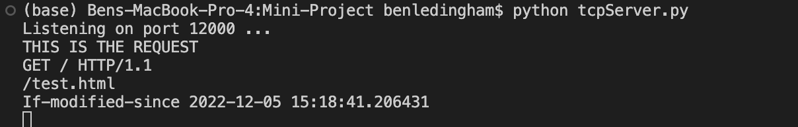
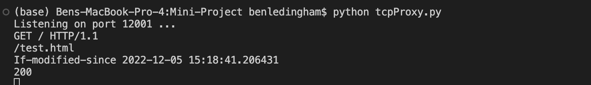

# Proxy Server Details

A proxy server exists to satisfy repeat requests from the client to the origin server, without traveling the full distance to the origin server. To implement a simple proxy server the following requirements have to be met.

1. The proxy server should be able to take a request from the client and make that same request of the origin server.
2. The proxy server should be able to take a response from the origin server and pass it back as a response to the client.
3. The proxy server should be able to cache objects that have passed through it.
4. The proxy server should be able to update the cached objects when a newer version is found in the origin server.
5. The proxy server should be able to pass the cached object back to the requesting client if it has not been updated in the origin server.


# Testing the Proxy Server

The following steps are the steps that I use to make sure that my proxy server is satisfying the above requirements.

1. Make sure the proxycache folder is empty. We want to simulate a situation where the test.html has never been requested.
2. Open the tcpProxy.py file and change the IP address argument to your own local IP. Open the tcpClient.py file and change the IP address to your own local IP.
3. Run the server and proxy server in two separate terminals using the following commands.
```
python tcpServer.py
```
```
python tcpProxy.py
```
4. Make a request to the server for test.html by running the tcpClient.py file with the following command.

```
python tcpClient.py
```
5. Verify that the return value is the test.html. Also, verify that the proxycache folder now has the test.html file cached in it.
6. While still keeping both the servers running, make another request using the same command. Verify that this command still returns the same html body even though at the origin server, the body has not been modified. This is because the proxy server is returning the cached object instead when it gets a 304 from the server.
7. Now change the test.html file that is in the root project folder in some way, add a div, add text to the p tags, whatever. Do not change the file in the proxycache! 
8. Now still with both servers still running, make a third request using the same command. This request should returned the newly changed contents. 
9. Check the test.html in the proxycache and verify that it is the newly changed version of the test.html.
10. If all of these tests checkout, then the proxy server satisfies the requirements outlined above.


# ScreenShots of the Output

The below screenshots are the results of running a simple client side request to the proxy server for the test.html, the proxy server did not have it cached at the time of the request.

## Client Side Output


## Server Side Output


## Proxy Output
